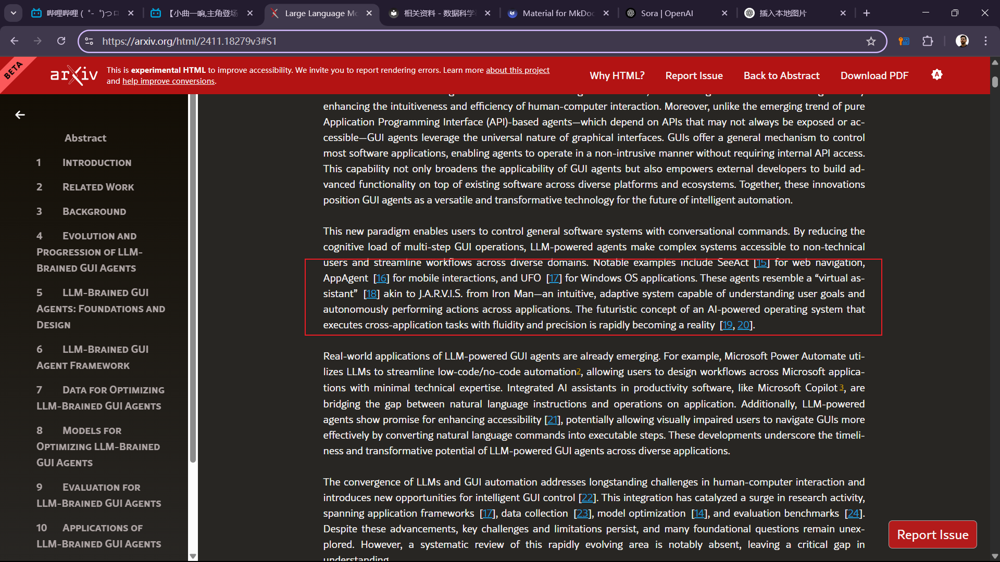
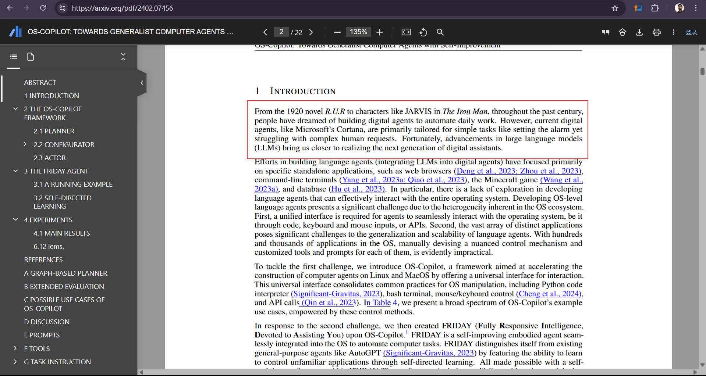

**相关论文解读学习**

---

感动，许多论文都提到了《钢铁侠》中的J.A.R.V.I.S，构建强大的智能体令人向往！！！

---

## 一、相关背景

### 1.Automation System
早期的自动GUI测试系统，算是GUI AGENT的前身，被用于自动完成GUI的功能测试。包括随机的测试和基于规则、基于脚本语言以及各种工具的测试。这些为GUI AUTOMATION奠定了基础。

### 2.深度学习的引入
后来随着深度学习的发展，CV和NLP技术的进步，GUI的自动化变得更加智能，CV帮助GUI理解交互界面的各种元素，从而更好的与这些元素进行交互以完成任务；NLP也可以辅助GUI理解人类的指令，进而完成交互任务。但仍然存在诸如受限训练方式、预先定义的任务等

### 3.以LLM为大脑的GUI AGENT
大模型的横空出世，提供了一个端到端的解决方案，从指令的分解到子任务的规划再到最后的可执行文本的生成和任务执行。大模型包揽了从Mobile、Web再到Desktop等不同载体的GUI AGENT实现。

## 二、智能体框架介绍

### 1. **环境感知**
在这一步，GUI AGENT会通过各种途径获取当前的环境信息，例如通过CV获取UI的各种元素（通过屏幕截图了解当前界面的状态信息），通过RAG的方式获取与任务相关的上下文信息（如系统的信息、需要使用的工具信息）

### 2. **提示词引擎**
在获取了所有需要的背景信息后，由专门的提示词引擎将这些信息整合起来形成用于指导LLM规划、分析的提示词模板，这样可以最大限度的发挥LLM的 **few-shot** 的能力，让它完成此次专门任务。

### 3. **LLM推理核心**
LLM，用于理解用户的指令，并根据相关信息把指令分解成不同的子任务，每个子任务又包含了详细的任务介绍，即任务的背景、步骤、工具调用等等。
   * 具体的规划方式，有传统的线性规划，也有基于**有向无环图**的规划方式，可以并行的执行不同的任务
### 4. **任务执行器**
