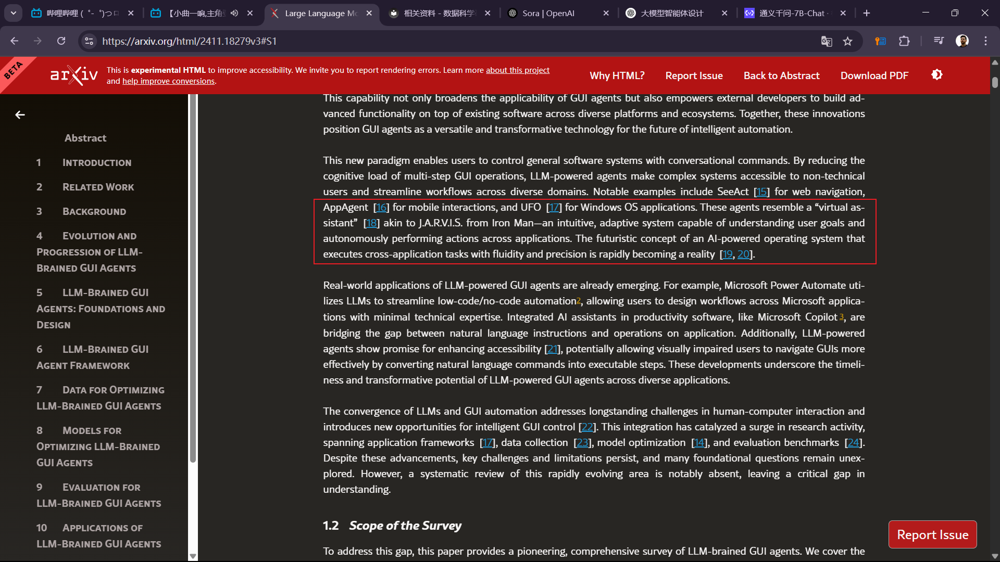

相关论文解读学习

---

令人感动，许多论文都提到了《钢铁侠》中的J.A.R.V.I.S，构建强大的智能体令人向往！！！

# 一、智能体框架介绍

1. **任务分解器**

    * 智能体与外界交互得到指令后，需要根据情况把指令分解成不同的子任务，包含了详细的任务介绍，即任务的背景、步骤、工具调用等等。因此这一步的关键在于了解智能体自身的能力，要知道自己能做什么后再去把指令分解成不同的子任务完成。
    * 具体的规划方式，有传统的线性规划，也有基于**有向无环图**的规划方式，可以并行的执行不同的任务
2. 